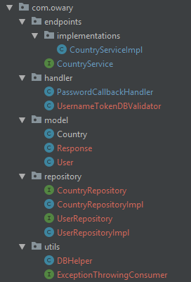

# WS-Security : PasswordText Authentication with Encrypted Password and Database

The previous example demonstrated the PasswordText password authentication method where we just sent the plain text password inside the SOAP envelope.
In this example, we will encrypt the user's password and persist it to database. So we won't match plain text but encrypted passwords.

## Structure is as follows


## 0. Adding necessary dependencies and making some changes.
```xml
<!--To get BCryptPasswordEncoder-->
<dependency>
    <groupId>org.springframework.security</groupId>
    <artifactId>spring-security-crypto</artifactId>
    <version>${spring.version}</version>
</dependency>


<!--To get the h2 database-->
<dependency>
    <groupId>com.h2database</groupId>
    <artifactId>h2</artifactId>
    <version>${h2.version}</version>
    <scope>runtime</scope>
</dependency>

<!--To make Spring work, change the scope to "runtime" from "provided"-->
<dependency>
    <groupId>javax.servlet</groupId>
    <artifactId>javax.servlet-api</artifactId>
    <version>${javax.servlet.version}</version>
    <scope>runtime</scope>
</dependency>
``` 


## 1.0 Create DAO classes
These classes are vanilla DAO classes with CRUD functionality. Since we use JDBC for database interactions, a little bit of a preprocessing is involved while beans are created. The preprocessing includes creating the tables and inserting some data.
 
 - [CountryRepository](./src/main/java/com/owary/repository/CountryRepositoryImpl.java)
 - [UserRepository](./src/main/java/com/owary/repository/UserRepositoryImpl.java)
 
**Note** : `@PostConstruct` annotation, as the name suggests executes the method after the bean has been created.

## 1.1 Utility method to establish a connection
The utility class is [DBHelper](./src/main/java/com/owary/utils/DBHelper.java) and it has some additional useful static methods.
```java
public static Connection getConnection() throws Exception {
    Class.forName("org.h2.Driver");
     Connection connection = DriverManager.getConnection("jdbc:h2:~/test", "sa", "");
     if (connection != null){
         return connection;
     }
     return null;
 }
```

## 2. Enable Autowiring and create beans
These changes are made in `cxf-servlet.xml` file.

```xml
<!-- Enables autowiring -->
<context:annotation-config/>

<!--Spring beans part-->
<bean id="countryRepository" class="com.owary.repository.CountryRepositoryImpl"/>
<bean id="userRepository" class="com.owary.repository.UserRepositoryImpl"/>
```

Now we can use `@Autowired` annotation to inject the beans we created.

## 3. Implementing the custom validation functionality.
The normal flow of UsernameToken WS-Security method is as follows:
 - User/Client provides the credentials (username, password), selects the password type as **PasswordText** and makes the request.
 - On receiving side, the `UsernameTokenValidator` class is invoked, to be precise its `validate` method is called. Based on the password type, the method delegates the processing to one of the `verify*` methods. By default all of these `verify*` methods calls `verifyDigestPassword` which is the only method that has an implementation.
 - `verifyDigestPassword` on its behalf, first, saves the password user provided, later it calls the registered `CallbackHandler` implementation. In the handler, the actual password of the user is set. Since we now have the original password the user sent and the actual password, they are checked if they are equal, then if no exception is raised, no action is taken.
 - Finally, `validate` method returns the credential if no exception is thrown.
 
We want to achieve the flow where user's password is matched with their hashed password in database. In normal flow, we can't do that unless it is PasswordDigest.

The steps we will carry out are as follows:
 - Implement the `CallbackHandler` which sets the hashed password from database for the particular user. We already have `PasswordCallbackHandler` class, but it is hardcoded; we have to make it work with database.
 - Extend the `UsernameTokenValidator` class and override the `verifyPlaintextPassword` method.

### 3.1 Modify the `PasswordCallbackHandler`'s `handle` method
Previously, it was acquiring the passwords from a Map. But this time we will use a database.
```java
public class PasswordCallbackHandler implements CallbackHandler {

    @Autowired
    private UserRepository repository;

    @Override
    public void handle(Callback[] callbacks) throws IOException, UnsupportedCallbackException {
        for(Callback cb : callbacks){
            WSPasswordCallback wspc = (WSPasswordCallback) cb;
            String identity = wspc.getIdentifier();
            User user = repository.getUserByUsername(identity);
            if (user != null && user.getUsername().equals(identity)) {
                wspc.setPassword(user.getPassword());
                return;
            }
        }
    }
}
```

As you can see, we `@Autowired` the DAO class and exploit it to get the user. After checking the validity of username, we set the user's password to `WSPasswordCallback` instance.

### 3.2 Extend the `UsernameTokenValidator` class
We have to override `verifyPlaintextPassword` method. Most of the code below has been taken from the `verifyPasswordDigest` method, but altered to work in our case.
```java
public class UsernameTokenDBValidator extends UsernameTokenValidator {

    @Override
    protected void verifyPlaintextPassword(UsernameToken usernameToken, RequestData data) throws WSSecurityException {
        // the credentials user supplied in request
        String passwordSupplied = usernameToken.getPassword();
        String usernameSupplied = usernameToken.getName();
        // password type
        String pwType = usernameToken.getPasswordType();
        // this instance is handled to the PasswordCallbackHandler we created.
        WSPasswordCallback pwCb = new WSPasswordCallback(usernameSupplied, null, pwType, 2);
        try {
            // call the handle method of our PasswordCallbackHandler
            // it will set the actual password
            data.getCallbackHandler().handle(new Callback[]{pwCb});
        } catch (UnsupportedCallbackException | IOException ex) {
            // any error occurs, throw validation error
            throw new WSSecurityException(WSSecurityException.ErrorCode.FAILED_AUTHENTICATION, ex);
        }
        // the actual password
        String passwordOriginal = pwCb.getPassword();

        // check if they don't match throw validation error, otherwise let it pass
        if (!passwordMatches(passwordSupplied, passwordOriginal)) {
            throw new WSSecurityException(WSSecurityException.ErrorCode.FAILED_AUTHENTICATION);
        }
    }
}

```
**Note** : `passwordMatches` is a DBHelper method that checks if a plaintext (user supplied) password matches with the hashed password.

## 4. cxf-servlet.xml changes concerning SOAP WS
```xml
<bean id="myPasswordCallback" class="com.owary.handler.PasswordCallbackHandler"/>
<!-- We create a bean for the validator we created -->
<bean id="usernameTokenDBValidator" class="com.owary.handler.UsernameTokenDBValidator"/>

<jaxws:endpoint id="countryService"
                address="/cs"
                implementor="com.owary.endpoints.implementations.CountryServiceImpl">

    <jaxws:inInterceptors>
        <bean class="org.apache.cxf.ws.security.wss4j.WSS4JInInterceptor">
            <constructor-arg>
                <map>
                    <entry key="action" value="UsernameToken"/>
                    <entry key="passwordType" value="PasswordText"/>
                    <entry key="passwordCallbackRef">
                        <ref bean="myPasswordCallback"/>
                    </entry>
                </map>
            </constructor-arg>
        </bean>
    </jaxws:inInterceptors>
    <!-- We add the properties to enable the validator and we mention our newly created bean-->
    <jaxws:properties>
        <entry key="ws-security.enable.nonce.cache" value="false" />
        <entry key="ws-security.enable.timestamp.cache" value="false" />
        <entry key="ws-security.ut.validator" value-ref="usernameTokenDBValidator"/>
    </jaxws:properties>
</jaxws:endpoint>
```