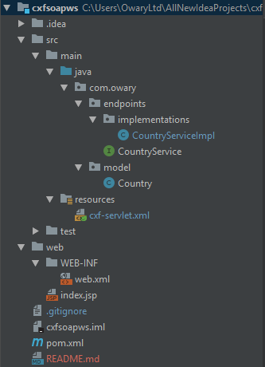

# SOAP Web Service using Apache CXF and Spring

To create the SOAP WS using CXF and Spring, follow the subsequent steps:

0. The structure of the application:


1. Create the Web Service interface
```java
@WebService
public interface CountryService {

    @WebMethod
    Country getCountry(String countryCode);

}
```

2. Implement the method in the interface
```java
@WebService(serviceName = "CountryService",
            endpointInterface = "com.owary.endpoints.CountryService")
public class CountryServiceImpl implements CountryService {

    @Override
    public Country getCountry(String countryCode) {
        return new Country("Benin", "Belmopan", 12.3, 12.3);
    }
}
```

3. Add the Deployment Descriptor - web.xml
```xml
<?xml version="1.0" encoding="UTF-8"?>
<web-app xmlns="http://xmlns.jcp.org/xml/ns/javaee"
         xmlns:xsi="http://www.w3.org/2001/XMLSchema-instance"
         xsi:schemaLocation="http://xmlns.jcp.org/xml/ns/javaee http://xmlns.jcp.org/xml/ns/javaee/web-app_4_0.xsd"
         version="4.0">

    <servlet>
        <servlet-name>cxf</servlet-name>
        <servlet-class>org.apache.cxf.transport.servlet.CXFServlet</servlet-class>
        <load-on-startup>1</load-on-startup>
    </servlet>

    <servlet-mapping>
        <servlet-name>cxf</servlet-name>
        <url-pattern>/ws/*</url-pattern>
    </servlet-mapping>

    <context-param>
        <param-name>contextConfigLocation</param-name>
        <param-value>classpath:cxf-servlet.xml</param-value>
    </context-param>

    <listener>
        <listener-class>
            org.springframework.web.context.ContextLoaderListener
        </listener-class>
    </listener>

</web-app>
```

4. Add the CXF Config file
```xml
<?xml version="1.0" encoding="UTF-8" ?>
<beans xmlns="http://www.springframework.org/schema/beans"
       xmlns:xsi="http://www.w3.org/2001/XMLSchema-instance"
       xmlns:cxf="http://cxf.apache.org/core"
       xmlns:jaxws="http://cxf.apache.org/jaxws"
       xmlns:soap="http://cxf.apache.org/bindings/soap"
       xsi:schemaLocation="http://cxf.apache.org/jaxws http://cxf.apache.org/schemas/jaxws.xsd http://cxf.apache.org/core http://cxf.apache.org/schemas/core.xsd http://www.springframework.org/schema/beans http://www.springframework.org/schema/beans/spring-beans.xsd http://cxf.apache.org/bindings/soap http://cxf.apache.org/schemas/configuration/soap.xsd">

    <jaxws:endpoint id="countryService"
                    address="/cs"
                    implementor="com.owary.endpoints.implementations.CountryServiceImpl"/>
                    
</beans>
```